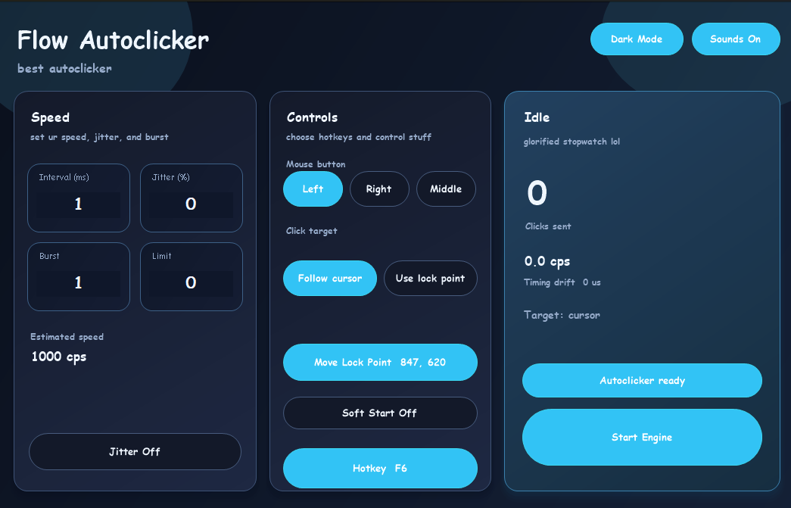

# Flow Autoclicker

Native Windows autoclicker written in C++.

Source-available under PolyForm Noncommercial 1.0.0. Forking, use, and redistribution are allowed for noncommercial purposes only.

## Example UI



## Build

Requirements:
- Visual Studio Build Tools with the C++ workload
- Windows SDK

```powershell
powershell -ExecutionPolicy Bypass -File .\build.ps1
```

The release executable is written to `build\Release\FlowAutoclicker.exe`.
